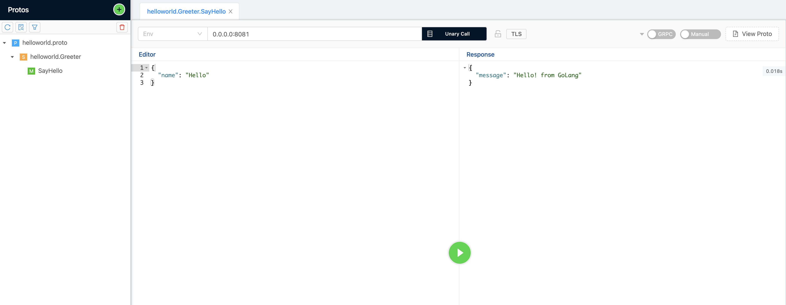

## Tech stack:
1. Java 17
2. gRPC - 1.48
3. gradle-7.1

# Overview

This gRPC generic proxy will be used when you have 1000 of existing REST API running in your server and at future you are planning to move everything to gRPC API.
Moving every existing REST API to gRPC is cumbersome task. 

The two prerequisite for this gRPC proxy are:  
   1. gRPC stubs generated (Service and Request/Response type classes)
   2. API mapping json (holds unique Service.Method name and Rest API configurations)
 
By Utilizing these two components we can trigger a http call to existing Rest API and retrieve the response and map the response to the gRPC generated response object.

##Note :  If you already moved your existing REST API to gRPC. Then you don't need this framework. This framework is kind of middleware (gRPC server) sits in between the gRPC client and the actual REST API server.

### Building the project

`gradle build`

The above command will generate the gRPC Service and Request, Response classes based on the `proto/helloworld.proto`

 

During the `gradle build` process, it will execute this gradle task `spinGoServer` to spin up a golang server
that will act as a actual REST Api.

If the golang server is not running on port 8081, you can manually start server by navigate to this path `go/server.go` and execute `go run server.go`

## Testing

